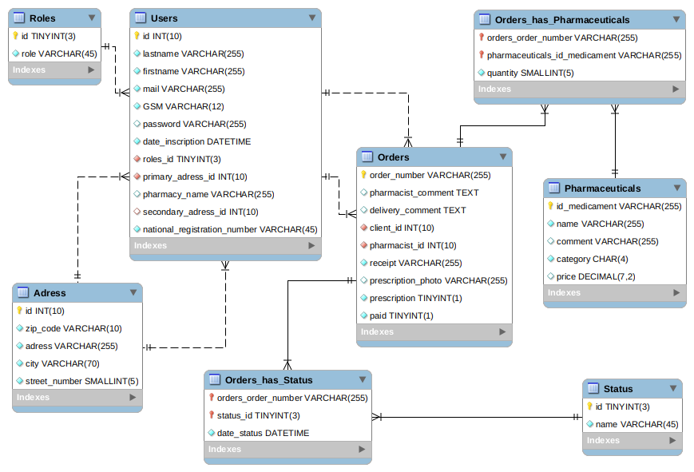

# Take Care - tableau de bord Pharmacien

Projet de fin de formation à la Wild Code School de Bruxelles - Février 2020.

Il s'agit d'une interface de gestion de commande de produit pharmaceutiques.

## Langages utilisés et MCD

### Langages

* **Langages** Javascript, HTML5, CSS3, SQL
* **Frameworks et librairies** ReactJS, NodeJS, MySQL, express
* **Dépendances front** Material-ui, axios, moment, react-router-dom
* **Dépendances back** body-parser, cors, mysql

### MCD



## Installation et lancement de l'app

Liste d'instructions pour faire fonctionner l'application sur une machine en local.

### Etape 1

Cloner le dépot puis basculer sur la branche dev.

### Etape 2

Installer les modules npm dans les dossiers `back-end` et `front-end`

```
npm install --save
```

### Etape 3

Créer une base de données avec le nom que vous souhaitez (par exemple take_care_db)

Importer la base de données depuis `back-end/stores/take_care_db_v6.sql` avec la commande suivante:

```
mysql -u username -p dbname < take_care_db_v6.sql
```

### Etape 4

Créer le fichier 'db.config.js' dans le dossier `back-end`

```
module.exports = {
    HOST :  'localhost', 
    USER :  'root', 
    PASSWORD :  VOTRE MOT DE PASSE,
    DB : VOTRE BASE DE DONNEES
}
```

### Etape 5

Lancer le serveur:
    Dans le dossier `back-end` exécuter la commande: `node app.js`

Lancer l'application:
    Dans le dossier `front-end` exécuter la commande: `npm start`

## Collaborateurs

* **Charles-Elie Dumoulin-Minguet** - [Cheldumi](https://github.com/Cheldumi)

* **Antoine Van Laethem** - [antoine-vl](https://github.com/antoine-vl)

* **Benoît Moëns** - [BenoitMoens](https://github.com/BenoitMoens)